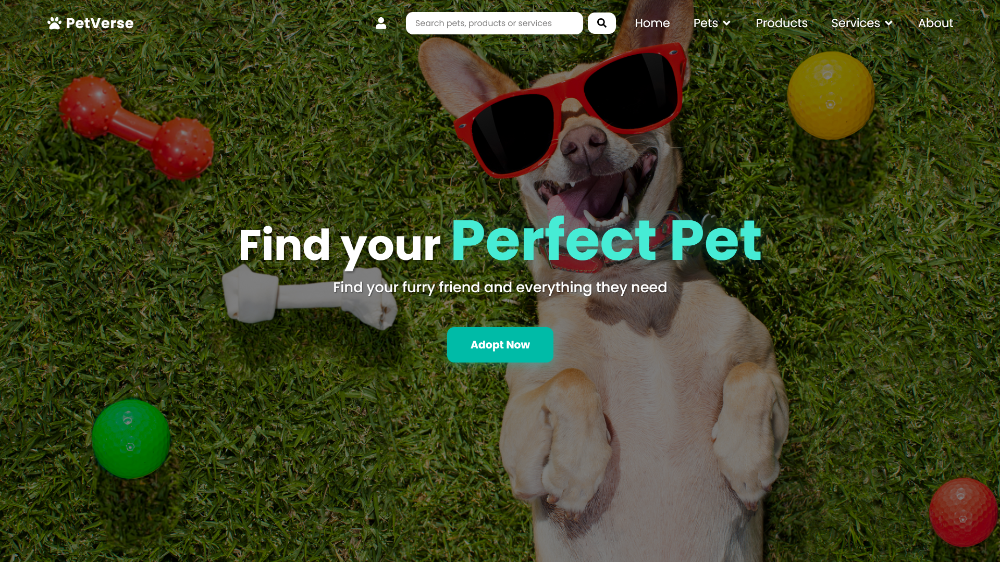

<div align="center">



&nbsp;

# 🐾 PetVerse

**Your one-stop destination for all pet needs.**

A full-stack web platform connecting pet owners, sellers, breeders, and service providers in one unified ecosystem.

[](https://nodejs.org/)
[](https://react.dev/)
[](https://www.mongodb.com/)
[](https://vitejs.dev/)
[](https://tailwindcss.com/)
[](https://opensource.org/licenses/MIT)

</div>

---

## Table of Contents

- [Overview](#overview)
- [Features](#features)
- [Tech Stack](#tech-stack)
- [Project Structure](#project-structure)
- [Getting Started](#getting-started)
- [Environment Variables](#environment-variables)
- [API Documentation](#api-documentation)
- [Contributing](#contributing)

---

## Overview

PetVerse is a comprehensive pet care platform that brings together every aspect of pet ownership into a single, seamless experience. Whether you are looking to adopt a new companion, shop for premium pet essentials, book professional grooming or veterinary services, find a suitable mate for your pet, or track a lost animal — PetVerse has you covered.

The platform supports three distinct user roles — **Pet Owners**, **Sellers**, and **Service Providers** — each with a dedicated dashboard, alongside a powerful **Admin** control panel for platform management.

---

## Features

### For Pet Owners

- **Pet Adoption** — Browse and adopt pets from verified breeders and rescues
- **Pet Mating** — Find compatible mates for your pet in a safe, responsible environment
- **Lost & Found** — Report lost pets and submit claims for found animals
- **Events** — Discover and register for pet-friendly community events
- **Product Shopping** — Add items to cart, manage wishlists, and checkout securely
- **Service Booking** — Schedule appointments with vets, trainers, and groomers
- **Digital Wallet** — Manage funds and track transactions within the platform
- **Order Tracking** — View order history and detailed order status
- **Reviews** — Leave feedback on products and services
- **Real-time Chat** — Communicate directly with sellers and service providers via Socket.io

### For Sellers

- **Seller Dashboard** — Manage product listings, inventory, and incoming orders
- **Order Management** — Process and update order statuses
- **Real-time Notifications** — Get instant updates on new orders via live chat

### For Service Providers

- **Service Dashboard** — List and manage services with pricing and descriptions
- **Availability Manager** — Define schedules and control booking slots
- **Booking Management** — Accept, update, or cancel appointment bookings

### Platform-wide

- **Admin Dashboard** — Full platform oversight including user management, approvals, and analytics
- **OTP Verification** — Email-based two-factor authentication for secure sign-up and login
- **Forgot Password Flow** — Secure password reset via email
- **Search** — Global search across pets, products, and services
- **Responsive Design** — Optimized for desktop and mobile using Tailwind CSS

---

## Tech Stack

### Frontend

| Technology                 | Purpose                               |
| -------------------------- | ------------------------------------- |
| React 19                   | UI framework                          |
| Vite 7                     | Build tool & dev server               |
| Redux Toolkit              | Global state management               |
| React Router v7            | Client-side routing                   |
| Tailwind CSS 4             | Utility-first styling                 |
| Socket.io Client           | Real-time bidirectional communication |
| Chart.js + react-chartjs-2 | Analytics and dashboard charts        |
| Axios                      | HTTP client                           |
| Lucide React / React Icons | Icon libraries                        |

### Backend

| Technology                                   | Purpose                                   |
| -------------------------------------------- | ----------------------------------------- |
| Node.js + Express                            | REST API server                           |
| MongoDB + Mongoose                           | Primary database & ODM                    |
| Socket.io                                    | Real-time WebSocket server                |
| Razorpay                                     | Payment gateway                           |
| Nodemailer                                   | Transactional email (OTP, password reset) |
| Helmet                                       | HTTP security headers                     |
| express-rate-limit                           | API rate limiting                         |
| express-mongo-sanitize                       | NoSQL injection prevention                |
| express-validator / Joi                      | Input validation                          |
| bcrypt                                       | Password hashing                          |
| Multer                                       | File uploads                              |
| Morgan                                       | HTTP request logging                      |
| Swagger (swagger-jsdoc + swagger-ui-express) | API documentation                         |

---

## Project Structure

```
PETVERSE/
├── backend/
│   └── src/
│       ├── app.js               # Express app entry point
│       ├── controllers/         # Route handler logic
│       ├── middleware/          # Auth, error handling, rate limiting
│       ├── models/              # Mongoose schemas
│       ├── routes/              # API route definitions
│       ├── scripts/             # Seed and utility scripts
│       ├── utils/               # Shared helpers
│       └── docs/                # Swagger configuration
└── frontend/
    └── src/
        ├── pages/               # Full-page React components
        ├── components/          # Reusable UI components
        ├── redux/               # Redux slices and store
        ├── services/            # Axios API service calls
        ├── hooks/               # Custom React hooks
        └── utils/               # Frontend utilities
```

---

## Getting Started

### Prerequisites

- [Node.js](https://nodejs.org/) v18 or higher
- [MongoDB](https://www.mongodb.com/) (local instance or Atlas URI)
- A [Razorpay](https://razorpay.com/) account (for payment features)
- An SMTP-capable email account (for OTP and password reset)

### 1. Clone the repository

```bash
git clone https://github.com/your-username/petverse.git
cd petverse
```

### 2. Set up the backend

```bash
cd backend
npm install
```

Create a `.env` file inside the `backend/` directory (see [Environment Variables](#environment-variables) below), then start the server:

```bash
npm run dev
```

The API server will start on `http://localhost:8080`.

### 3. Set up the frontend

```bash
cd frontend
npm install
npm run dev
```

The frontend dev server will start on `http://localhost:3000`.

### 4. Seed initial data

Use the provided seed scripts to create the admin account and initialize wallets:

```bash
cd backend
npm run create:test-user
```

Sellers and service providers can be registered directly through the application UI.

---

## Environment Variables

Create a `.env` file in the `backend/` directory with the following keys:

```env
# Database
MONGODB_URI=<your_mongodb_connection_uri>

# Server
PORT=8080
NODE_ENV=development
FRONTEND_URL=http://localhost:3000

# Session
SESSION_SECRET=<a_long_random_secret_string>

# Email (Nodemailer — used for OTP and password reset)
EMAIL_USER=<your_smtp_email_address>
EMAIL_PASSWORD=<your_smtp_email_password>

# Payments (Razorpay)
RAZORPAY_KEY_ID=<your_razorpay_key_id>
RAZORPAY_KEY_SECRET=<your_razorpay_key_secret>
```

---

## API Documentation

Interactive API docs are available via Swagger UI once the backend server is running:

```
http://localhost:8080/api-docs
```

---

## Contributing

1. Fork the repository
2. Create a feature branch: `git checkout -b feature/your-feature-name`
3. Commit your changes: `git commit -m 'feat: add your feature'`
4. Push the branch: `git push origin feature/your-feature-name`
5. Open a Pull Request

---

<div align="center">

Made with ❤️ by the PetVerse Team

</div>
